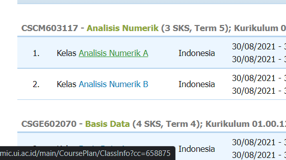
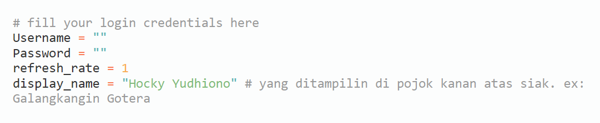
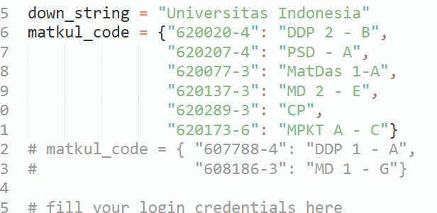
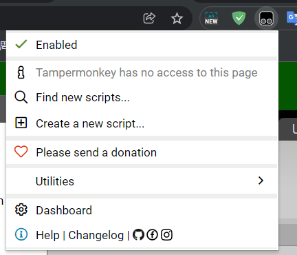
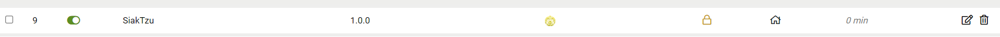

# SiakTzu

Co-author: Hocky, Dennis, Galang

SiakWar + Sun Tzu ez ez

- Login with your UI Account https://academic.ui.ac.id/main/Authentication/
- Put your `classcode-credit` (grab from : https://academic.ui.ac.id/main/Schedule/Index)
- 
- For example, this is `658875-3`

## Selenium Firefox Automated Bot (Bot)

- Fill `Username`, `Password`, and `display_name`
  - ignore `refresh_rate`
  - 
- Update `matkul_code` dictionary, value is not important, key is `classcode-credit`
- 
- Run `python SiakTzu.py` in cmd
  - In case of error, make sure firefox is installed https://github.com/mozilla/geckodriver/releases and find the appropriate firefox option or suitable Operating System (Mac/Linux), put the geckodriver in the same folder.

## JS Version (Injects Scripts Using Chrome)

Example of use :

- Install [tampermonkey](https://chrome.google.com/webstore/detail/tampermonkey/dhdgffkkebhmkfjojejmpbldmpobfkfo?hl=id), Add the script, by pressing `Create a new script...`
- 
- Paste [SiakTzu.js](./SiakTzu.js)
- get to this (https://academic.ui.ac.id/main/CoursePlan/CoursePlanEdit) when you can Add your IRS
- It will automatically check, and scroll to bottom, but you must press submit by your own.
- Win The War !
- 

